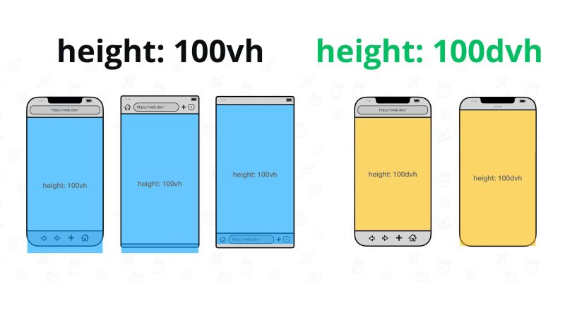

## 📌 Información adicional 
- **CSS**: 
    - https://www.w3schools.com/css/default.asp
- **CSS**: 
    - https://css-tricks.com/
- **Beautiful CSS box-shadow**: 
    - https://getcssscan.com/css-box-shadow-examples
- **Flexbox**: 
    - https://css-tricks.com/snippets/css/a-guide-to-flexbox/
- **Fondos degradados**: 
    - https://uigradients.com/
- **Separator**
    - https://wweb.dev/resources/css-separator-generator
- **Shape dividers**
    - https://www.shapedivider.app/
    - https://css-generators.com/
- **CSS Loader**
    - https://css-loaders.com/

## 🎯 Games
- **Grid Garden**: 
    - https://cssgridgarden.com/#es
- **Flex Froggy**: 
    - https://flexboxfroggy.com/#es 
- **Flex zombies**: 
    - https://mastery.games/flexboxzombies/ 

